# Visualizador de datos de corrupción en Chile

[Aplicación web](https://bastianoleah.shinyapps.io/corrupcion_chile/) que permite visualizar datos sobre los casos más relevantes de corrupción en Chile.

La corrupción ha copado los medios comunicacionales en los últimos meses. Sin embargo, la información que deciden presentar u omitir, y el modo mismo en que la exponen, es generalmente tendencioso. Por eso, el objetivo de este visualizador es presentar visualmente los datos de casos de corrupción en el país, especificando sus responsables y sectores políticos, para transparentar la información completa.

Este visualizador compila datos abiertos sobre este tema país, y produce gráficos que permiten analizar cómo y desde dónde ha operado la corrupción en Chile.

## Casos de corrupción por monto
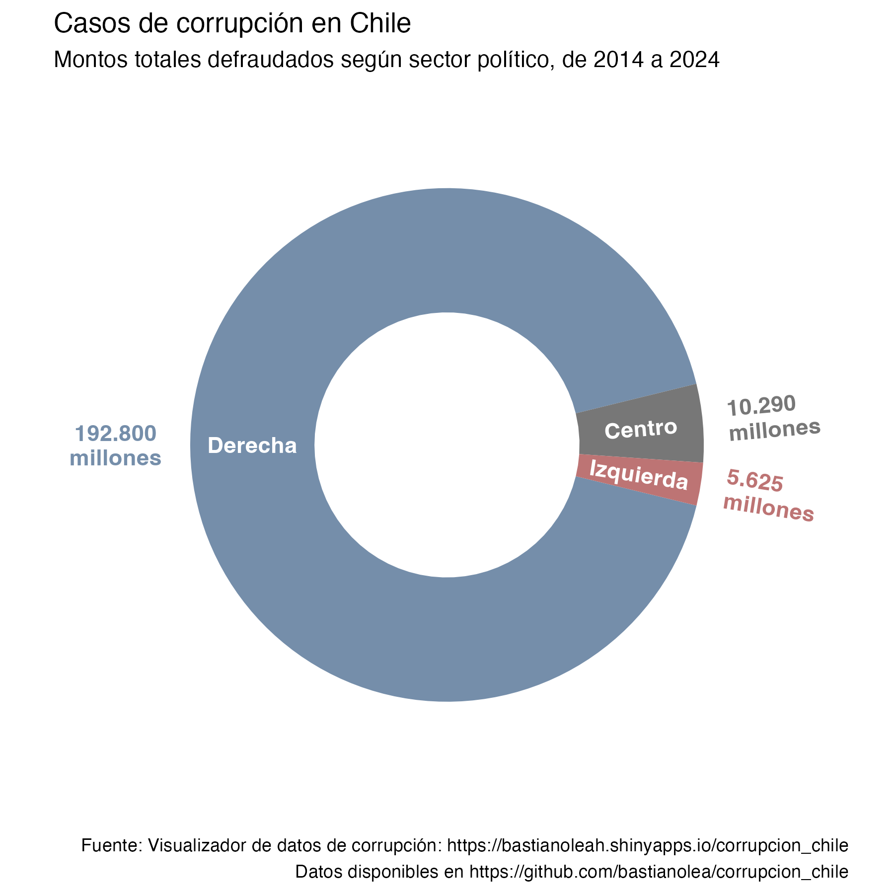
----
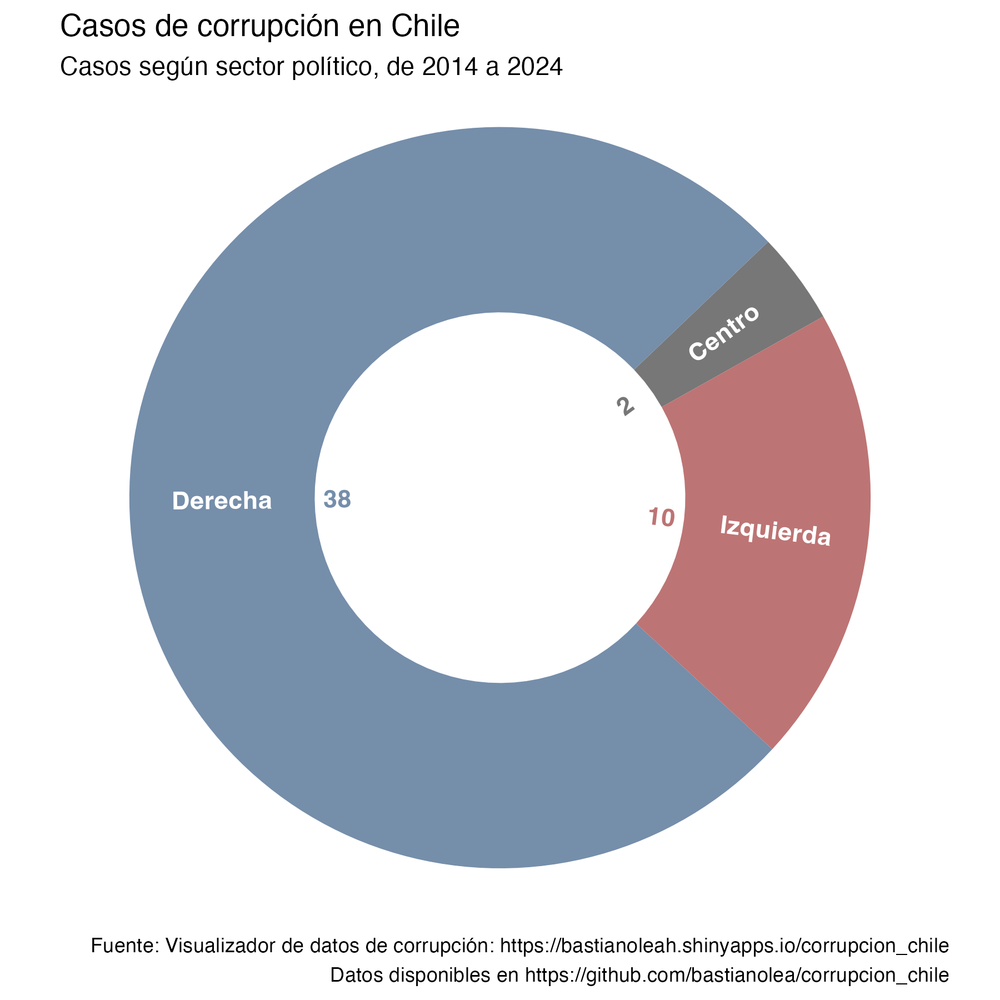
----
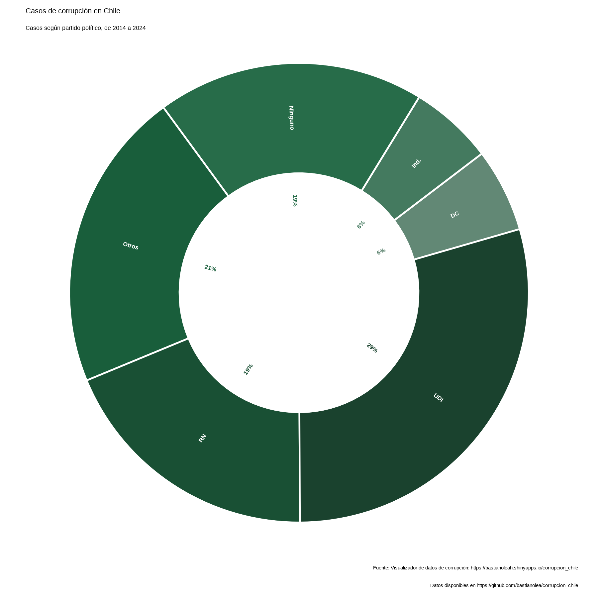
----
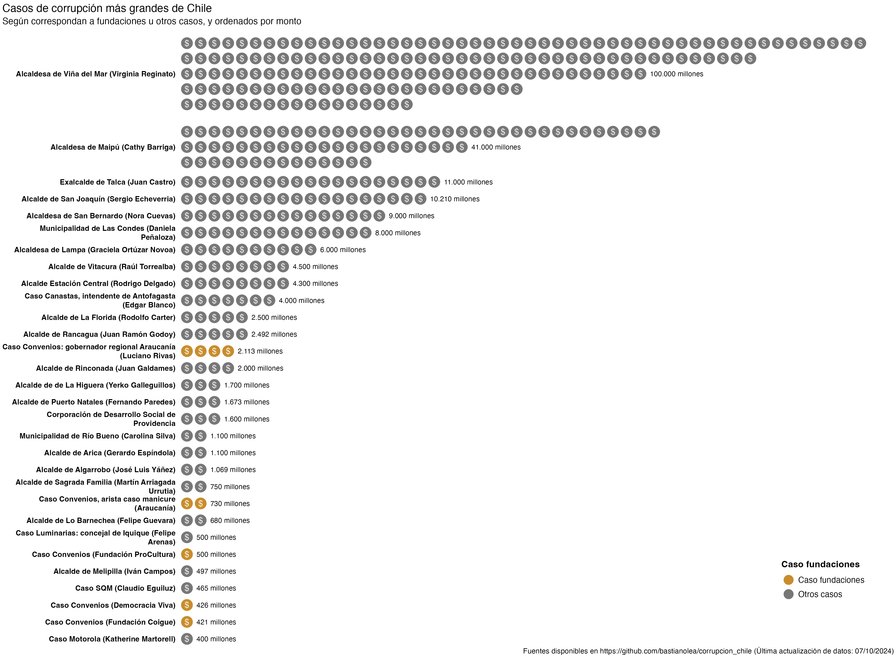
----
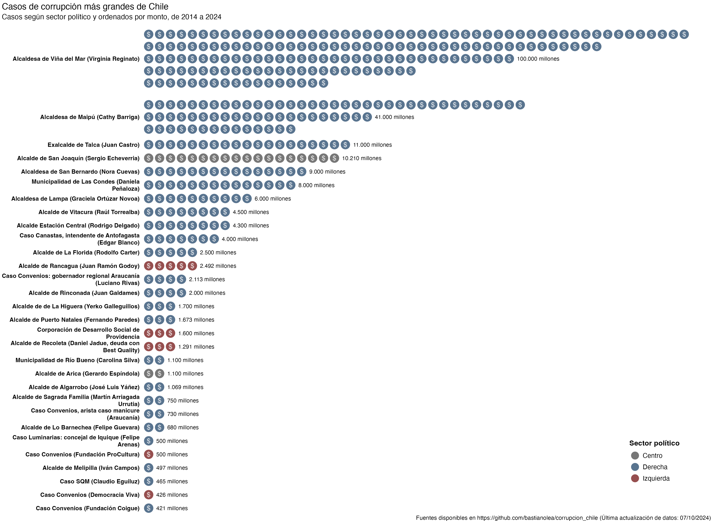
----
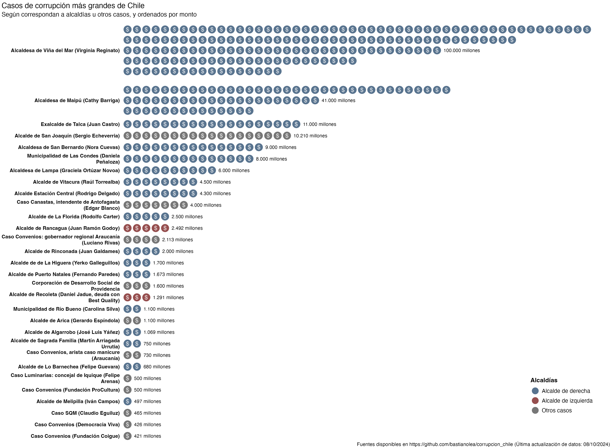

----

### Tabla de casos de corrupción donde implicados tengan afiliación a partidos políticos
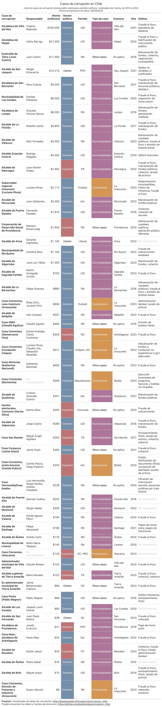

----

## Casos de corrupción en municipios

### Tabla de casos de corrupción donde implicados tengan afiliación a partidos políticos
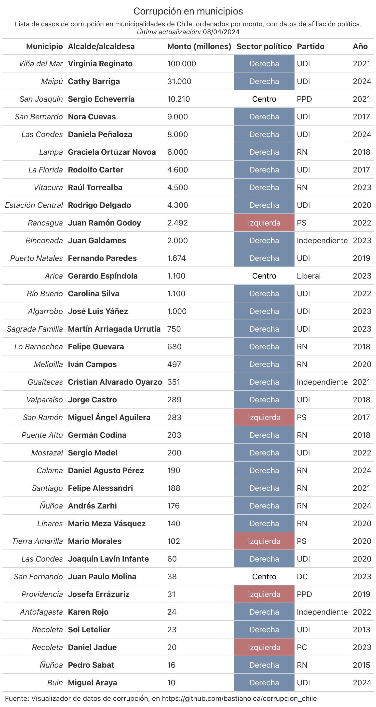
----

### Mapa de casos de corrupción en municipalidades de la Región Metropolitana
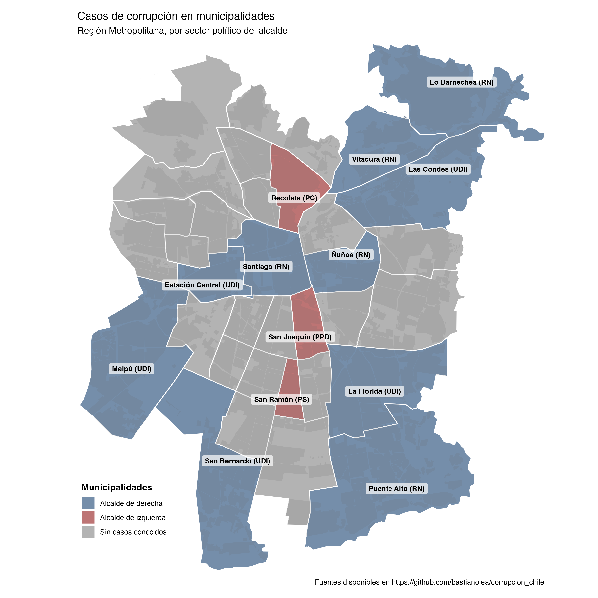
----
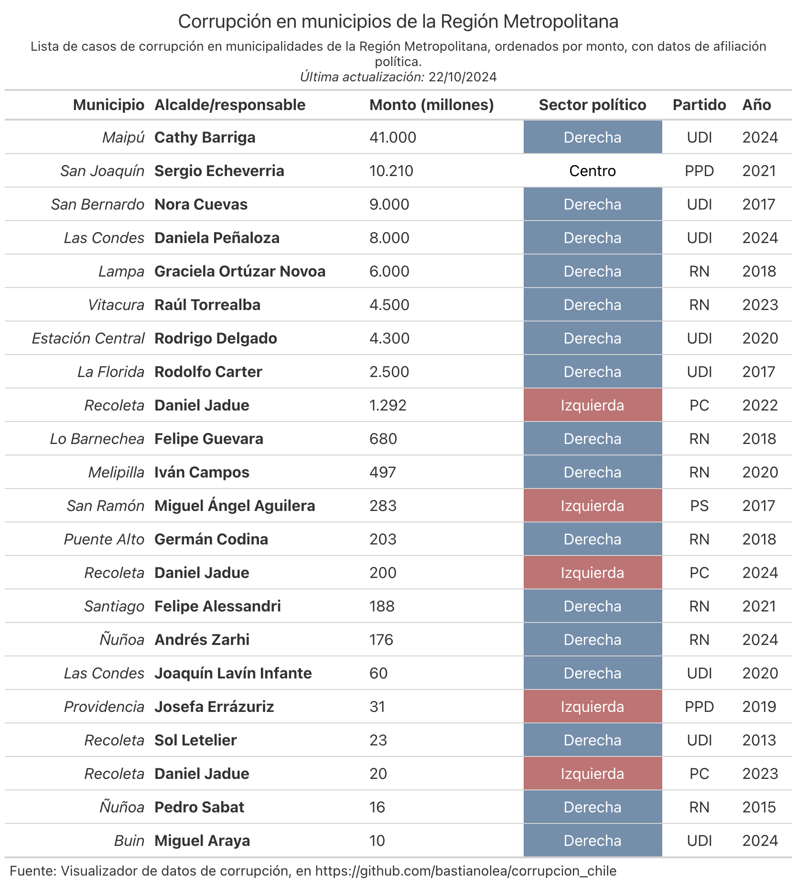

### Metodología
Los datos son organizados en una planilla con sus respectivas fuentes y la información disponible en casa caso. Accede a la carpeta `datos` para revisarlos.

### Fuente de los datos
Los datos están siendo compilados manualmente en este repositorio, por lo que se trata de una aplicación en constante proceso. Si quieres complementar los datos existentes, ayudar con correcciones, agregar casos nuevos, o hacer cualquier comentario, puedes encontrar los datos en el [repositorio](https://github.com/bastianolea/corrupcion_chile), o bien, [contactarme](http://bastian.olea.biz) por alguno de los medios disponibles en mi sitio web.

_Otras fuentes de datos:_
- Encuesta CEP, cuyos datos son obtenidos a través del [Graficador CEP](https://www.cepchile.cl/opinion-publica/encuesta-cep/), visualizador de datos de la Encuesta CEP programado por Bastián Olea Herrera como parte del equipo DataUC.
- Índice de percepción de la corrupción (Corruption Perceptions Index), [Tranparency International](https://www.transparency.org/en/cpi/2023/index/chl)

### Acceder a la app

[La aplicación web está disponible en shinyapps.io](https://bastianoleah.shinyapps.io/corrupcion_chile/), o bien, puedes clonar este repositorio en tu equipo para usarla por medio de RStudio.

### Sobre la app
El sistema de análisis de datos está programado en R, y la app misma está desarrollada en Shiny, un paquete de R para el desarrollo de aplicaciones web interactivas.

Algunas peculiaridades de la app:

- **Gráfico de barras conformadas por puntos, y divisibles en múltiples barras por caso:** Se aplica un procesamiento peculiar a los datos de montos de corrupción para generar el gráfico de pseudo-barras, que usa puntos en lugar de barras. Por un lado, se deben transformar los montos a una escala común, donde cada unidad es representada por un punto, para así obtener un gráfico de pictogramas. El escalamiento es sencillo, y en este caso se hace entre 1 y 15, donde el mayor monto sería representado por 15 círculos. Pero luego, y ya que algunos montos son demasiado grandes en comparación con otros, estas barras constituidas por círculos son divididas en múltiples barras, para que las barras grandes no ocupen tanto espacio en el gráfico. Dado que esta no es una funcionalidad nativa al paquete de visualización de datos que se usa, `ggplot2`, usamos ingenisamente el sistema de facetas para que cada caso se ubique en una faceta del gráfico, y así puedan haber múltiples barras que correspondan a un solo caso. Finalmente, se realizan varios procedimientos para que las etiquetas, nombres de los casos, y otros elementos queden correctamente alineadas con estas barras triples, dado que de lo contrario un caso con tres barras tendría su nombre puesto tres veces.

- **Gráfico de comparación de montos en su equivalente a precios de otras cosas, que mantiene sus proporciones:** El gráfico que permite comparar montos de casos de corrupción con su equivalente en vehículos, propiedades o incluso hospitales, tiene la particularidad de que presenta cientos o miles de cuadraditos pequeños. Sin embargo, estos cuadraditos siempre se ven equidistantes y ordenados, sin importar el ancho de la ventana del usuario. Esto se hace definiendo una cantidad de cuadraditos por fila, y luego se calcula cuantos pixeles usarían esa cantidad de cuadraditos en el tamaño de ventana del usuario, para usar esa proporción al momento de definir el largo del gráfico. De esa forma, los cuadraditos usarán el tamaño de la ventana o pantalla del usuario para un efecto más impactante, pero siempre se verán ordenados.

- **Carga de elementos en base al desplazamiento del usuario:** Dado que se decidió que la aplicación sea larga hacia abajo, resulta que hay demasiados elementos por cargarse al abrir el sitio, sobre todo algunos gráficos y tablas que son de tamaño considerable. Para agilizar la carga del sitio, se implementó código en JavaScript que permite obtener la posición vertical del usuario en la ventana como un input para Shiny; es decir, podemos saber si el usuario está en la parte superior de la app, o si se ha desplazado hacia abajo. De este modo, solamente cargamos los elementos grandes al final del sitio si el usuario ha hecho scroll lo suficiente como para ver dichos elementos.

#### Pantallazos
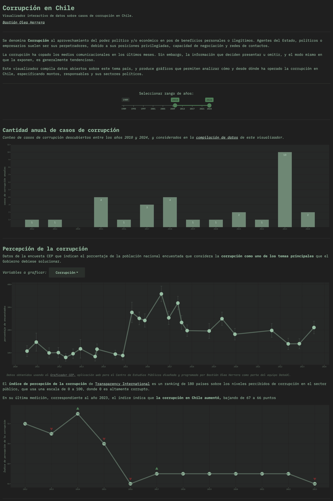
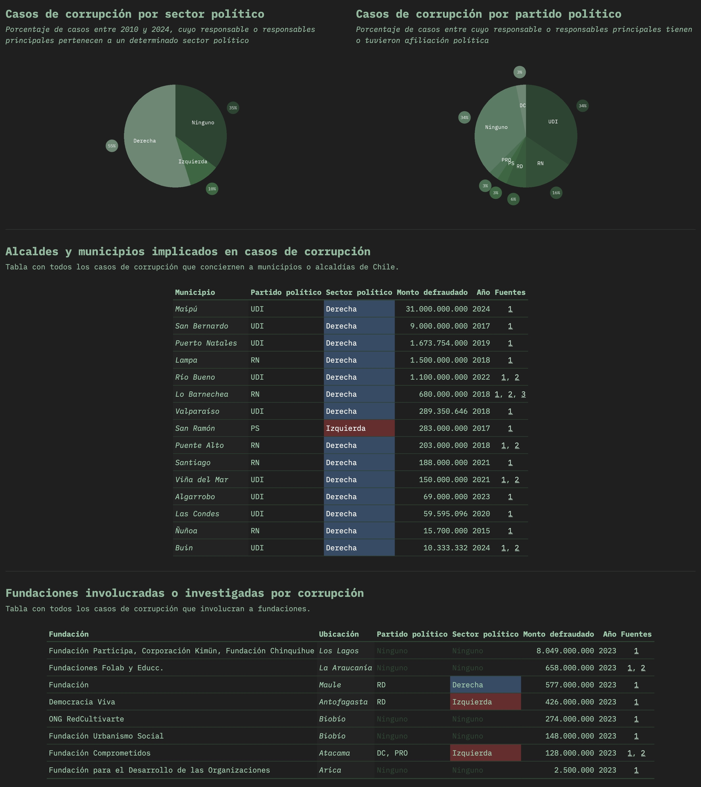

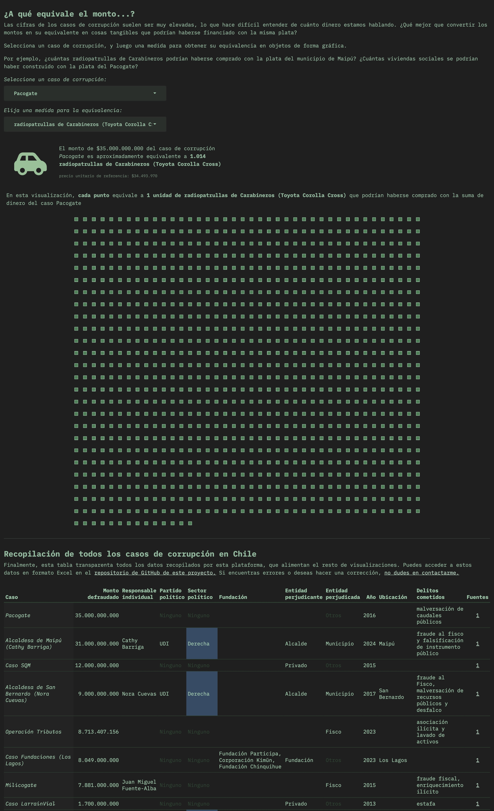

### Estructura del proyecto

Esta breve sección explica a grandes rasgos cómo funciona este proyecto, en términos programáticos.

Todo el contenido de este repositorio depende de un archivo de datos en formato Excel, `datos/casos_corrupcion_chile.xlsx`. Este archivo es producido a partir de `datos/casos_corrupcion_chile.numbers`, que es una planilla de Apple Numbers, pero también podría editarse directamente el Excel. En esta planilla se almacenan manualmente todos los datos de la plataforma.

Los datos de la plataforma se procesan ejecutando el script `corrupcion_procesar.R`, que procesa los datos desde el archivo Excel para dejarlos en formato .rds (nativo de R) en el archivo `app/corrupcion_datos.rds`. Este archivo es el que alimenta la aplicación y todos los gráficos y tablas.

El script `corrupcion_graficar.R` ejecuta varios otros scripts que producen gráficos, tablas y mapas a partir de los datos procesados, `app/corrupcion_datos.rds`. Los gráficos, tablas y mapas se guardan en las carpetas `graficos`, `tablas` y `mapas`, respectivamente, con nombres de archivo con o sin fecha. Los archivos sin fecha son usados en este `readme.md` para mantener actualizadas las visualizaciones estáticas, y los con fecha se guardan sólo por temas de archivación de versiones anteriores.

---- 

Diseñado y programado en R por Bastián Olea Herrera. Magíster en Sociología, data scientist.

https://bastian.olea.biz

bastianolea@gmail.com

----

_Agradecimientos:_
- Miguel Oyarzo