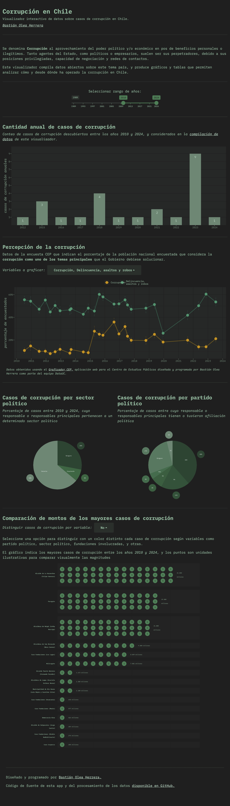

# Visualizador de datos de corrupción en Chile

[Aplicación web](https://bastianoleah.shinyapps.io/corrupcion_chile/) que permite visualizar datos sobre los casos más relevantes de corrupción en Chile.

La corrupción ha copado los medios comunicacionales en los últimos meses. Sin embargo, la información que deciden presentar u omitir, y el modo mismo en que la exponen, es generalmente tendencioso. Por eso, el objetivo de este visualizador es presentar visualmente los datos de casos de corrupción en el país, especificando sus responsables y sectores políticos, para transparentar la información completa.

Este visualizador compila datos abiertos sobre este tema país, y produce gráficos que permiten analizar cómo y desde dónde ha operado la corrupción en Chile.

### Fuente de los datos
Los datos están siendo compilados manualmente en este repositorio, por lo que se trata de una aplicación en constante proceso. Si quieres complementar los datos existentes, ayudar con correcciones, agregar casos nuevos, o hacer cualquier comentario, puedes encontrar los datos en el [repositorio](https://github.com/bastianolea/corrupcion_chile), o bien, [contactarme](http://bastian.olea.biz) por alguno de los medios disponibles en mi sitio web.

_Otras fuentes de datos:_
- Encuesta CEP, cuyos datos son obtenidos a través del [Graficador CEP](https://www.cepchile.cl/opinion-publica/encuesta-cep/), visualizador de datos de la Encuesta CEP programado por Bastián Olea Herrera como parte del equipo DataUC.
- Índice de percepción de la corrupción (Corruption Perceptions Index), [Tranparency International](https://www.transparency.org/en/cpi/2023/index/chl)

### Acceder a la app

[La aplicación web está disponible en shinyapps.io](https://bastianoleah.shinyapps.io/corrupcion_chile/), o bien, puedes clonar este repositorio en tu equipo para usarla por medio de RStudio.

---- 

Diseñado y programado en R por Bastián Olea Herrera. Magíster en Sociología, data scientist.

https://bastian.olea.biz

bastianolea@gmail.com
